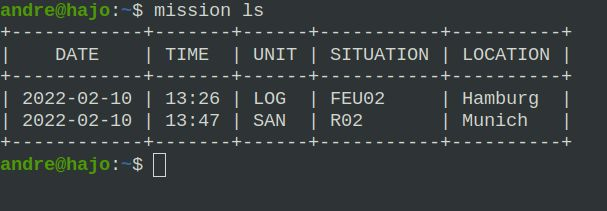

# baldeweg/mission

A CLI to administer a log file of missions.



## Requirements

- [Go](https://go.dev/)
- Basic knowledge about the command line

## Getting Started

First, you need to install [Go](https://go.dev/).

Download the project archive from the [git repository](https://github.com/abaldeweg/mission).

Inside the project directory, you can build the app with the `go build` command. If you have [GoReleaser](https://goreleaser.com/) installed, instead run `goreleaser build --snapshot --rm-dist`.

Run the command `mission`. Depending on the OS you need to add a file extension.

The app will create a log file and add a template for every new mission. The details needs to be added to the `missions.json` directly via an editor.

The `missions.json` file will be created in your working directory. Please, keep the indentation - that's very important for YAML to work correctly.

Find more about YAML:

- [yaml.org](https://yaml.org/)
- [Wikipedia](https://en.m.wikipedia.org/wiki/YAML)

## Storage

Create a `.env` file to define where to store the logfile.

```env
// .env

STORAGE=bucket
BUCKET_NAME=name
GOOGLE_APPLICATION_CREDENTIALS=service-account-file.json
```

- STORAGE - Can be file or bucket
- BUCKET_NAME - If bucket was chosen as storage, then define the bucket name.
- GOOGLE_APPLICATION_CREDENTIALS - Key File, only for buckets

## Commands

- mission ls - Lists all missions
- mission new - Adds a new mission
- mission html - Exports the missions to an HTML file
- mission web - Starts the webserver
- mission help - Shows the help

## Flags

- `--path` - Specify the directory where the data should be stored.
